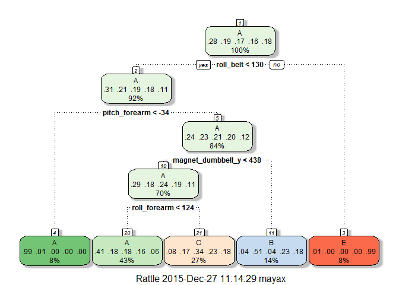

# PML: Course Project
apmay  
December 26, 2015  

## Introduction

The purpose of this work is to train a machine learning algorithm on a set of data and then be able to make further predictions about similar data not contained in the original data set. For this project, the data set contains measurements from six accelerometers worn by participants as they performed barbell lifts correctly and incorrectly in five different ways. After training the algorithm the goal is to assign the correct classification to how barbells were lifted in an unlabeled validation set with 20 groups of measurements. More information is available from <http://groupware.les.inf.puc-rio.br/har>.

## Data Processing

For data partitioning, training, and predicting the caret package will be used. The rattle package will be used for visualization. A seed is set for reproducibility purposes.


```r
library(caret)
```

```
## Warning: package 'caret' was built under R version 3.2.2
```

```
## Loading required package: lattice
## Loading required package: ggplot2
```

```
## Warning: package 'ggplot2' was built under R version 3.2.2
```

```r
library(rattle)
```

```
## Warning: package 'rattle' was built under R version 3.2.3
```

```
## Rattle: A free graphical interface for data mining with R.
## Version 4.0.5 Copyright (c) 2006-2015 Togaware Pty Ltd.
## Type 'rattle()' to shake, rattle, and roll your data.
```

```r
library(rpart)
library(randomForest)
```

```
## Warning: package 'randomForest' was built under R version 3.2.3
```

```
## randomForest 4.6-12
## Type rfNews() to see new features/changes/bug fixes.
```

```r
set.seed(351)
```

The data is provided in two CSV files. The pml-training set contains data with the classifications provided while the pml-testing set contains the 20 unclassified groups of data that are to be predicted. We will split the pml-training data into a training set (60%) and a testing set (40%). The unlabeled pml-testing data will then be used for the final prediction/validation.


```r
pml.training <- read.csv("pml-training.csv")
inTrain <- createDataPartition(y=pml.training$classe, p=.6, list = FALSE)
training <- pml.training[inTrain,]
testing <- pml.training[-inTrain,]

pml.testing <- read.csv("pml-testing.csv")
validation <- pml.testing
```

For preprocessing the data there are a few steps that must be carried out. First, there are quite a few variables which have near zero variance. These types of variables can cause models to become unstable or crash, so we remove them. Second, there are also quite a few variables that contain mostly NA's. Using too many of these variables may cause the models to become biased to cases when the variables either are or are not NA. Variables that are more than 75% NA are removed as well. Finally, we are interested in predicting the activity class based on the accelerometer data, not by participant, ID, date, etc. Therefore, the columns with this type of data (1-5) are also removed.


```r
nzv <- nearZeroVar(training)
training <- training[, -nzv]
testing <- testing[, -nzv]
validation <- validation[, -nzv]

threshNA <- sapply(training, function(x) mean(is.na(x)) > .75)
training <- training[, threshNA == FALSE]
testing <- testing[, threshNA == FALSE]
validation <- validation[, threshNA == FALSE]

training <- training[, -c(1:5)]
testing <- testing[, -c(1:5)]
validation <- validation[, -c(1:5)]
```

## Prediction with Decision Tree

As a start, a simple "off-the-shelf" decision tree will be used to get a sense of the data and the ease of prediction. The model is trained to predict the training set's classification (classe) based on all the variables remaining after preprocessing. The model is then applied to the testing set, and a confusion matrix is created to compare the testing set's predictions to the actual activity classes.


```r
modelTree <- train(classe ~ ., method="rpart", data=training)
fancyRpartPlot(modelTree$finalModel)
```

 

```r
treePredict <- predict(modelTree, newdata=testing)
confusionMatrix(treePredict, testing$classe)
```

```
## Confusion Matrix and Statistics
## 
##           Reference
## Prediction    A    B    C    D    E
##          A 2032  661  651  613  207
##          B   33  473   42  206  194
##          C  160  384  675  467  400
##          D    0    0    0    0    0
##          E    7    0    0    0  641
## 
## Overall Statistics
##                                           
##                Accuracy : 0.487           
##                  95% CI : (0.4759, 0.4981)
##     No Information Rate : 0.2845          
##     P-Value [Acc > NIR] : < 2.2e-16       
##                                           
##                   Kappa : 0.3286          
##  Mcnemar's Test P-Value : NA              
## 
## Statistics by Class:
## 
##                      Class: A Class: B Class: C Class: D Class: E
## Sensitivity            0.9104  0.31159  0.49342   0.0000  0.44452
## Specificity            0.6202  0.92494  0.78219   1.0000  0.99891
## Pos Pred Value         0.4880  0.49895  0.32359      NaN  0.98920
## Neg Pred Value         0.9457  0.84851  0.87969   0.8361  0.88872
## Prevalence             0.2845  0.19347  0.17436   0.1639  0.18379
## Detection Rate         0.2590  0.06029  0.08603   0.0000  0.08170
## Detection Prevalence   0.5307  0.12083  0.26587   0.0000  0.08259
## Balanced Accuracy      0.7653  0.61827  0.63780   0.5000  0.72171
```

The accuracy here is 48.7%, leaving an out of sample error of approximately 51.3%. This is fair for such a simple model, but it highlights certain splits that are not coming very clean. This could likely be improved with increasing tree complexity. However, complex trees start to lose interpretability and there are other methods that can typically improve accuracy even further.

## Prediction with Random Forests

In an attempt for further model accuracy, we now employ a random forest model. The method is set to cross-validation with four folds to balance computational cost and model performance. The model is again fit with the training set and then applied on the testing set to compare test set predictions to the actual classes.


```r
trainFolds = trainControl(method="cv", number=4)
modelForest <- train(classe ~ ., method="rf", trControl = trainFolds, data=training)
forestPredict <- predict(modelForest, newdata=testing)
confusionMatrix(forestPredict, testing$classe)
```

```
## Confusion Matrix and Statistics
## 
##           Reference
## Prediction    A    B    C    D    E
##          A 2232    4    0    0    0
##          B    0 1513    7    0    0
##          C    0    1 1358    9    0
##          D    0    0    3 1277    4
##          E    0    0    0    0 1438
## 
## Overall Statistics
##                                           
##                Accuracy : 0.9964          
##                  95% CI : (0.9948, 0.9976)
##     No Information Rate : 0.2845          
##     P-Value [Acc > NIR] : < 2.2e-16       
##                                           
##                   Kappa : 0.9955          
##  Mcnemar's Test P-Value : NA              
## 
## Statistics by Class:
## 
##                      Class: A Class: B Class: C Class: D Class: E
## Sensitivity            1.0000   0.9967   0.9927   0.9930   0.9972
## Specificity            0.9993   0.9989   0.9985   0.9989   1.0000
## Pos Pred Value         0.9982   0.9954   0.9927   0.9945   1.0000
## Neg Pred Value         1.0000   0.9992   0.9985   0.9986   0.9994
## Prevalence             0.2845   0.1935   0.1744   0.1639   0.1838
## Detection Rate         0.2845   0.1928   0.1731   0.1628   0.1833
## Detection Prevalence   0.2850   0.1937   0.1744   0.1637   0.1833
## Balanced Accuracy      0.9996   0.9978   0.9956   0.9960   0.9986
```

Here the accuracy is 99.6%, leaving an out of sample error estimate of only 0.4%.

Random forests appear to be quite effective at classifying these activity cases. Therefore we will move forward with this type of model for predicting the validation set. The previously created model (modelForest) is likely built upon enough data to classify the validation set appropriately, but we could also retrain the model with all available data instead of just a portion, knowing that the training and testing sets did not appear to be significantly different. The accuracy and out of sample error for this method should be similar to modelForest, or slightly improved if the original training set was noticeably less representative.


```r
finalData <- rbind(training,testing)
finalModel <- train(classe ~ ., method="rf", trControl = trainFolds, data=finalData)
finalPredict <- predict(finalModel, newdata=validation)
finalPredict
```

```
##  [1] B A B A A E D B A A B C B A E E A B B B
## Levels: A B C D E
```

## Results and Conclusion

The simple decision tree showed fair results, and provided a simple visual and interpretable model for how the data could be used to predict the activity classes. This was valuable for a first understanding of the data, but the performance was insufficient for our classification purposes. A random forest model showed great improvement over the decision tree, providing sufficient accuracy to correctly classify the entire validation set.


